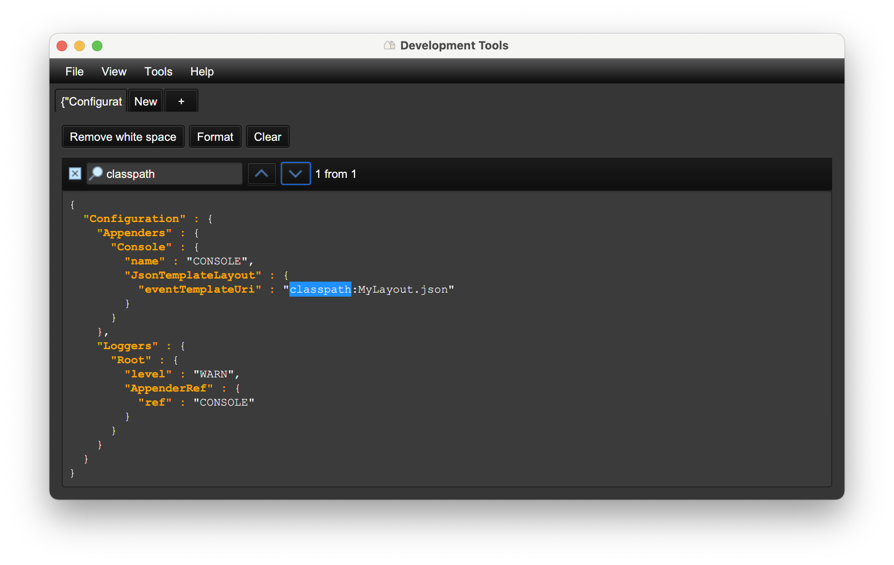
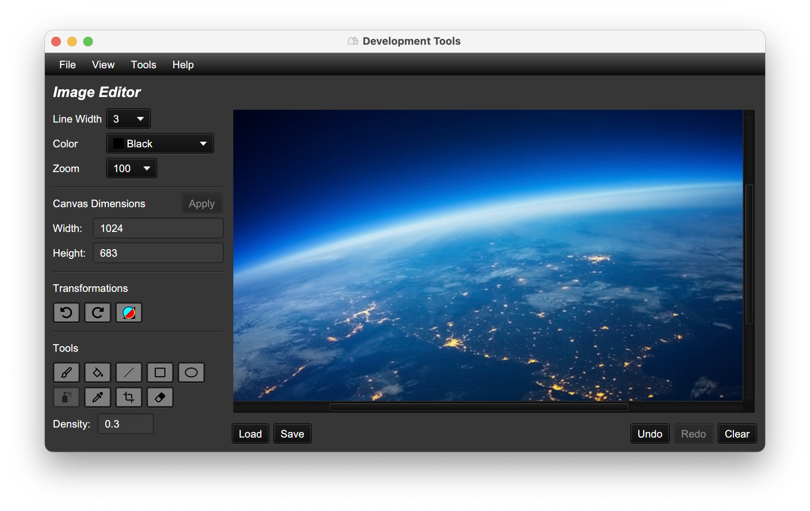
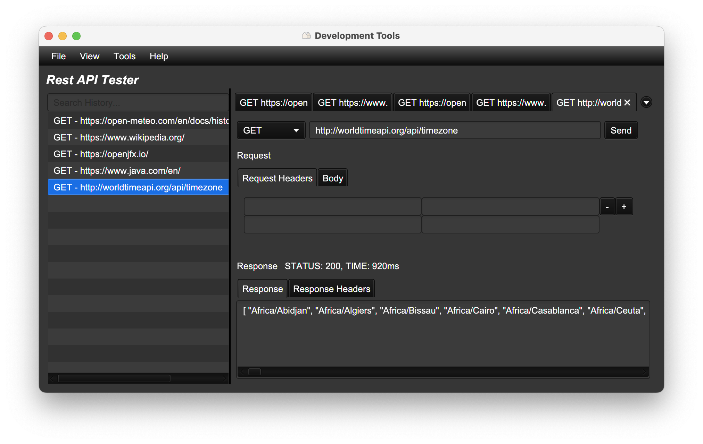
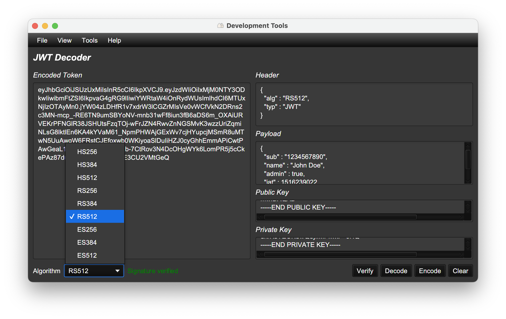
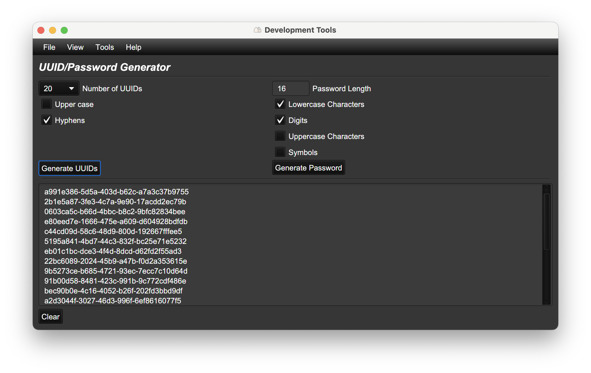
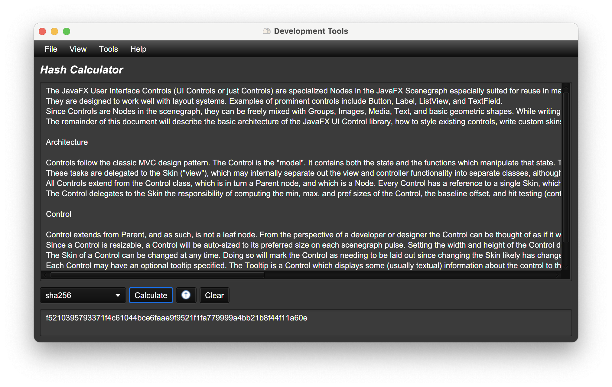
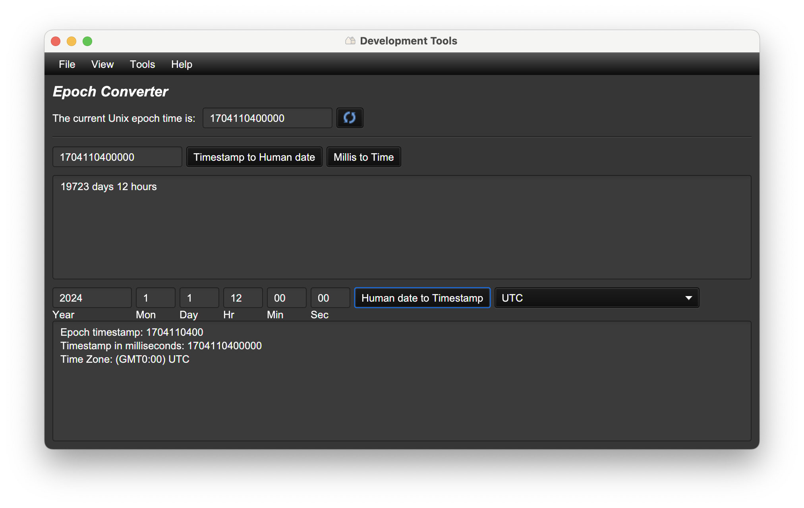
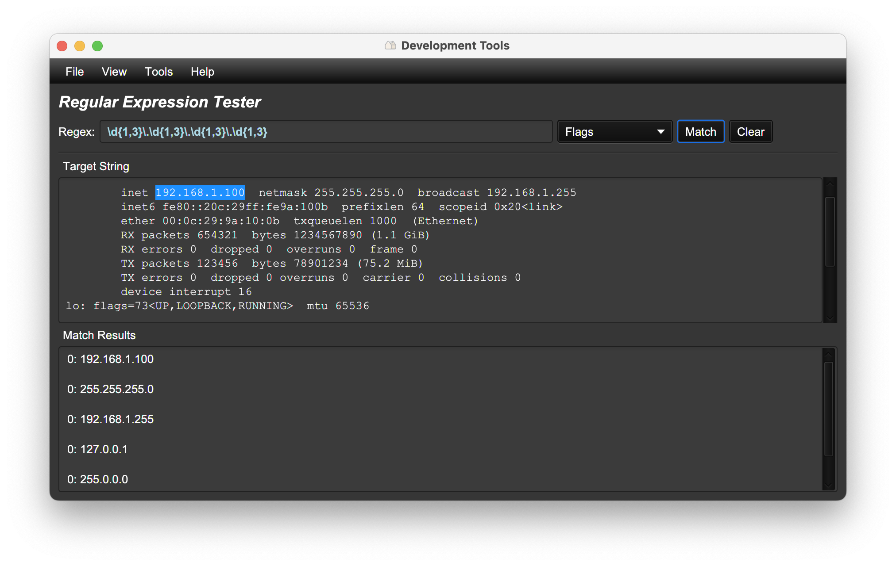
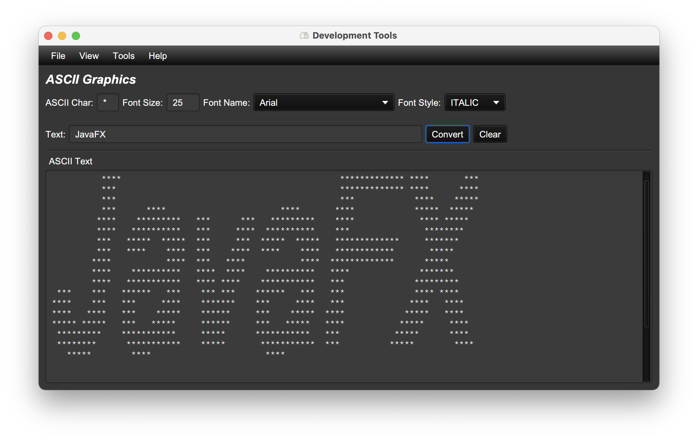
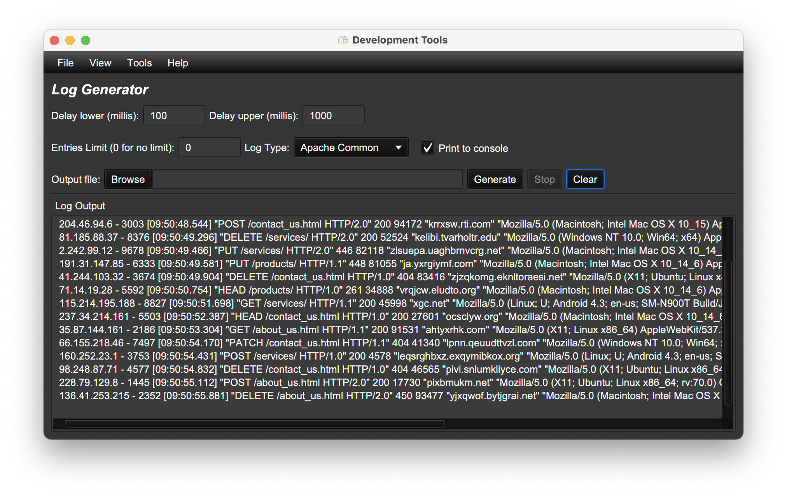

# dev-tools 

A collection of developer utilities in a single desktop application.

* [JSON Editor](#json-editor)
* [Image Editor](#image-editor)
* [Rest API Tester](#rest-api-tester)
* [JWT Decoder](#jwt-decoder)
* [UUID/Password Generator](#uuid-password-generator)
* [Hash Calculator](#hash-calculator)
* [Epoch Converter](#epoch-converter)
* [Regular Expression Tester](#regular-expression-tester)
* [ASCII Graphics](#ascii-graphics)
* [Log Generator](#log-generator)

## Installation

The application is built with [jeka](https://jeka.dev) so executable or installable from anywhere.

Install jeka if you don't have it: https://jeka-dev.github.io/jeka/installation/

Then execute, ```jeka app: install repo=devtools@djeang```.

The application will be built and installed in your PATH.
To launch the application, execute ```devtools``` command-line from anywhere.

You can visit my jeka catalog for other tools: ```jeka app: catalog name=djeang```


## Getting Started

* Explore the main menu and its options.
* Select a tool from the `Tools` dropdown menu. See below for a complete list with screenshots.
* Switch between light and dark themes using the `View -> Theme` menu option.
* Utilize keyboard shortcuts for faster navigation.

## Tool List

### JSON Editor

Edit and analyze JSON using syntax highlighting, formatting, and validation.
Use the built-in search (Ctrl+F) to find items. Navigate between documents using the multi-tab interface.



### Image Editor

This tool incorporates an essential suite of functions for creating and editing images.



### Rest API Tester

This tool provides a core set of functionalities for REST API testing.
Manage and share your testing process via the export and import of HTTP request history.
Access history features by Ctrl-clicking the history pane. Navigate between requests using the multi-tab interface.



### JWT Decoder

Paste your JSON Web Token (JWT) into the input area to decode it. Use the provided buttons to
decode, encode, and verify the JWT signature. For signature verification, select the correct algorithm and provide
the necessary secrets.



### UUID-Password Generator

Generate a series of UUIDs (Universally Unique Identifiers) or passwords according to the provided configuration
controls.



### Hash Calculator

This utility performs cryptographic hashing and various encoding/decoding operations on input data.



### Epoch Converter

Epoch Converter is a utility for converting between Unix epoch time (seconds since January 1, 1970, 00:00:00 UTC)
and human-readable dates. Features include displaying the current Unix epoch, timestamp to date/time
conversion, and date/time to timestamp conversion.



### Regular Expression Tester

Regular Expression Tester is a tool for testing and debugging regular expressions (regex) featuring full regex flag
support (i, m, u, etc.), comprehensive capturing group visualization and match highlighting.



### ASCII Graphics

Easily turn your text into ASCII art. Customize the look with adjustable settings.



### Log Generator

Log Generator creates customizable synthetic log data for testing and development.
Choose from a selection of pre-defined standard log formats.
Write the generated logs directly to the output pane, or save them to a file for later use.



## License

Licensed under the Apache 2.0 license.
